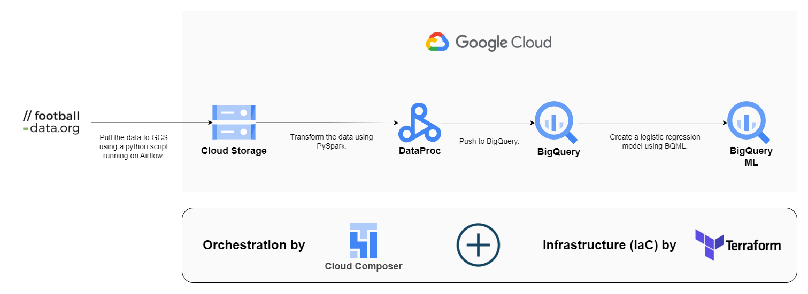

## English priemer league matches prediction using GCP

## Architecture

## Tech Stack
- **Languages:** SQL, Python
- **GCP Services:** BigQuery ML, Cloud Composer, DataProc, Cloud Storage
- **Third Party Services:** Terraform, football-data.org

## Important Note
Predicting football matches result is very complex, as it depends on many different factors such as team form, players market value, key players' form, current table rank, weather, and many other factors which aren't easy to access. This is an experimental project that uses only historical head-to-head matches.

- **I don't recommend using the output of this project. Use it at your own risk.**

